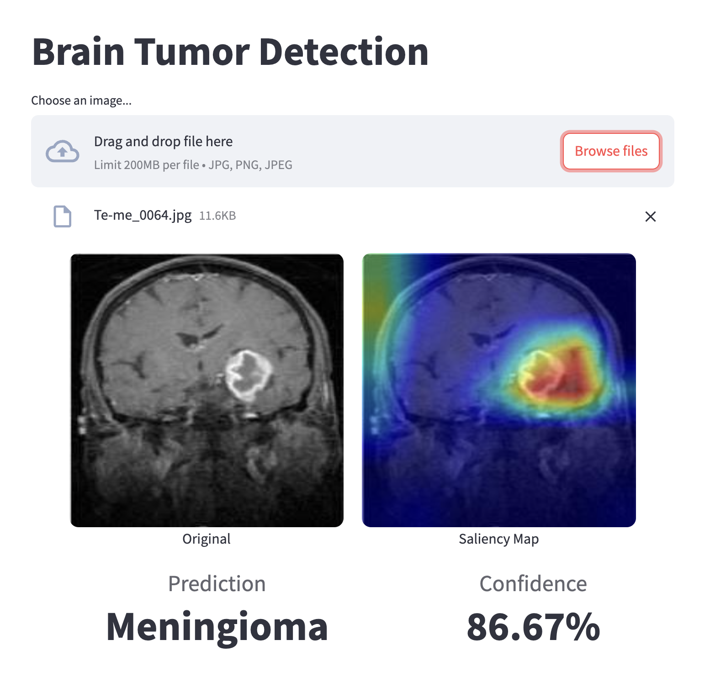

# Brain Tumor Classifier

## About The Project
A comprehensive deep learning solution for automated brain tumor classification using MRI scans.
This project leverages a state-of-the-art EfficientNet architecture to accurately detect and classify three types of brain tumors: glioma, meningioma, and pituitary tumors. 

The system is deployed as a production-ready web application that allows medical professionals to upload MRI scans and receive instant predictions with visualization of the model's decision process using GradCAM technology.

Built with modern MLOps practices, the pipeline includes containerized deployment on AWS cloud infrastructure, managed through infrastructure-as-code principles.

Key features:
- Real-time tumor classification with confidence scores
- Advanced visualization of model attention using GradCAM
- Scalable cloud deployment using AWS EC2 and ECR
- Infrastructure automation with Terraform
- Interactive web interface built with Streamlit

<br>

<div align="center">
    
</div>

## Stack

- **Deep Learning**: PyTorch, torchvision
- **Cloud Services**: AWS (EC2, ECR)
- **Infrastructure**: Terraform
- **Containerization**: Docker
- **Web Interface**: Streamlit
- **Development**: Python, Git

## Directory Structure
```
  root_directory/
  │
  ├── app.py
  ├── Dockerfile
  ├── data/
  ├── models/
  ├── notebooks/
  ├── terraform/
  ├── utils/
  ├── README.md
  └── requirements.txt
```

## Streamlit Web App deployment via EC2 and ECR

### Installation

#### ECR local setup
1. Install AWS CLI if not installed
    ```
    brew install awscli
    ```

2. Configure AWS credentials
    ```
    aws configure
    ```

3. Create ECR repository
    ```
    aws ecr create-repository --repository-name <repository-name>
    ```

4. Get ECR login credentials and login
    ```
    aws ecr get-login-password --region <aws-region> | docker login --username AWS --password-stdin <aws-account-id>.dkr.ecr.<aws-region>.amazonaws.com
    ```

5. Tag image for ECR
    ```
    docker tag <docker-image-name>:<tag> <aws-account-id>.dkr.ecr.<aws-region>.amazonaws.com/<docker-image-name>:<tag>
    ```

6. Push image to ECR
    ```
    docker push <aws-account-id>.dkr.ecr.<aws-region>.amazonaws.com/<docker-image-name>:<tag>
    ```

#### EC2 setup
1. Provision infrastructure with Terraform
    ```shell
    terraform -chdir=terraform apply
    ```

2. Download the `.pem` file and set permissions:

   ```shell
   chmod 400 <your-key-file.pem>
   ```

3. Connect to the EC2 via SSH

   ```shell
   ssh -i </path/to/key-file.pem> ec2-user@<instance-public-ip>
   ```

4. Install Docker
    ```shell
    sudo yum install docker -y
    sudo service docker start
    sudo usermod -a -G docker ec2-user
    newgrp docker
    ```

5. Install AWS CLI
    ```shell
    curl "https://awscli.amazonaws.com/awscli-exe-linux-x86_64.zip" -o "awscliv2.zip"
    unzip awscliv2.zip
    sudo ./aws/install
    ```

6. Configure AWS region
    ```
    aws configure
    ```

7. ### Log in to ECR
    ```
    aws ecr get-login-password --region <aws-region> | docker login --username AWS --password-stdin <aws-account-id>.dkr.ecr.<aws-region>.amazonaws.com
    ```

8. Pull container
    ```
    docker pull <aws-account-id>.dkr.ecr.<aws-region>.amazonaws.com/<docker-image-name>:<tag>
    ```

9. Run container
    ```
    docker run -d -p 8501:8501 <aws-account-id>.dkr.ecr.us-east-1.amazonaws.com/<docker-image-name>:<tag>
    ```

10. Access the Stramlit app using the EC2 public IP address:
    ```
    http://<ec2-public-ip>:8501
    ```

### Useful Commands:

- To destory the infrastructure provisioned

  ```
  terraform -chdir=terraform destroy
  ```

## Contributing

- [Headstarter.co](https://headstarter.co/)
- Matteo Pilotto
